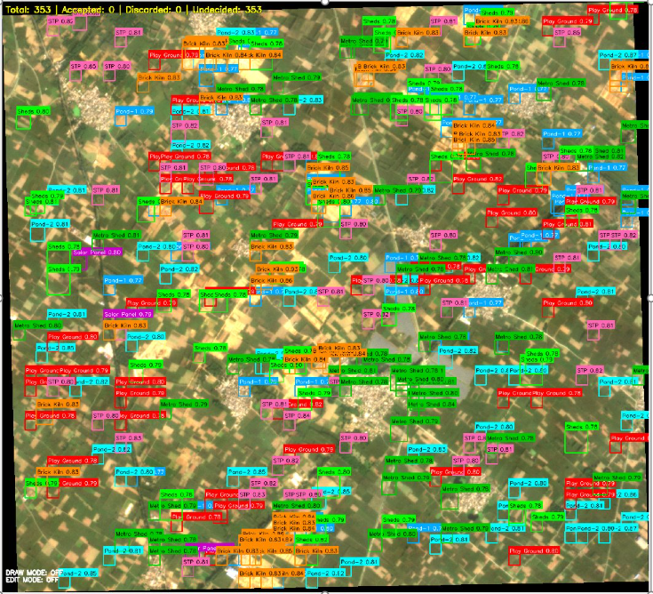

# ⚡ DINO-SAM-Accel: GPU-Optimized Geospatial Annotation

**Accelerating Geospatial Intelligence through DINOv2, SAM2, and GPU Optimization.**
Developed under the **SvarAikyam AI / AI Fusion** research initiative, this project unites **DINOv2** self-supervised embeddings, **Segment Anything 2 (SAM2)** polygon refinement, and classical **LBP + NDWI** features — all optimized for GPU-accelerated annotation and visual search in high-resolution satellite imagery.

---

## 🌍 Overview

**DINO-SAM-Accel** enables *automated detection, labeling, and visual search* across multi-band satellite datasets — empowering geospatial workflows through AI-driven similarity and segmentation refinement.

Supported object classes:

> Brick Kiln | STP | Solar Panel | Sheds | Metro Shed | Play Ground | Pond-1 | Pond-2

### 🔹 Core Pipelines

| Stage                               | Description                                                                                                                          |
| ----------------------------------- | ------------------------------------------------------------------------------------------------------------------------------------ |
| **Prototype Creation**              | `create_features_dino.py` / `create_features_LBP_RGB.py` extract DINOv2 or LBP+NDWI feature vectors from annotated `.json` polygons. |
| **Batch Prototype Builder**         | `batch_create_dino_prototypes.sh` automates feature generation for all TIF + JSON pairs.                                             |
| **Auto-Annotation (GPU Optimized)** | `auto_annotate_dino_nvtx_optimized.py` performs window-based detection using FAISS similarity search with optional SAM2 refinement.  |
| **Batch Detection**                 | `batch_auto_annotate_dino.sh` runs the optimized annotator across datasets.                                                          |
| **Interactive Review UI**           | `ui_review.py` enables OpenCV-based visual verification, class editing, and YOLO export.                                             |

---

## ⚙️ GPU Profiling & Agentic Optimization

Integrated with **Nsight Systems**, **Nsight Compute**, and **Torch Profiler** for kernel-level insights, enabling precise GPU workload tuning.
Includes experimental support for **Agentic GPU Optimization**, orchestrating autotuning of CUDA kernels and Triton ops for real-time efficiency gains on **RTX 3060**, **Jetson Orin**, and **Qualcomm RB5** edge devices.

---

## 🖼️ Example Result

Annotated output from the full DINOv2 + SAM2 pipeline:

<p align="center">
  
</p>

---

## 🧩 Dependencies

* Python ≥ 3.10
* PyTorch ≥ 2.2 with CUDA 12.x
* Transformers (HuggingFace)
* Rasterio, OpenCV, NumPy, Scikit-image, Pandas
* [Segment-Anything 2](https://github.com/facebookresearch/segment-anything-2) for SAM2 polygonization

```bash
pip install torch torchvision torchaudio transformers rasterio opencv-python scikit-image pandas tqdm shapely
```

---

## 🚀 Quick Start

1. **Generate Prototypes**

   ```bash
   bash batch_create_dino_prototypes.sh
   ```
2. **Run Auto-Annotation**

   ```bash
   bash batch_auto_annotate_dino.sh
   ```
3. **Review & Refine**

   ```bash
   python ui_review.py
   ```
4. **Export YOLO / GeoJSON Outputs**
   via `batch_stats.rebuild_summary_and_labels()` or `yolo_to_geojson.py`

---

## 🧠 Research Context

**DINO-SAM-Accel** represents a unified GPU-accelerated geospatial AI workflow that fuses:

* **DINOv2 embeddings** for invariant patch-level representation
* **SAM2 segmentation refinement** for precision polygonization
* **LBP + NDWI fusion** for spectral-texture augmentation
* **Agentic profiling & kernel discovery** for adaptive GPU efficiency

Designed for **researchers and developers in remote sensing, computer vision, and HPC-AI convergence**, it bridges edge inference and cloud-scale analytics for Earth observation intelligence.

---

## 📄 Citation

```
@misc{dino_sam_accel_2025,
  title  = {DINO-SAM-Accel: GPU-Optimized Auto-Annotation for Satellite Imagery},
  author = {Atul Vaish},
  year   = {2025},
  url    = {https://github.com/intelav/DINO-SAM-Accel}
}
```

---

© 2025 SvarAikyam AI | AI Fusion — Applied Research in GPU Optimization & Geospatial Intelligence

